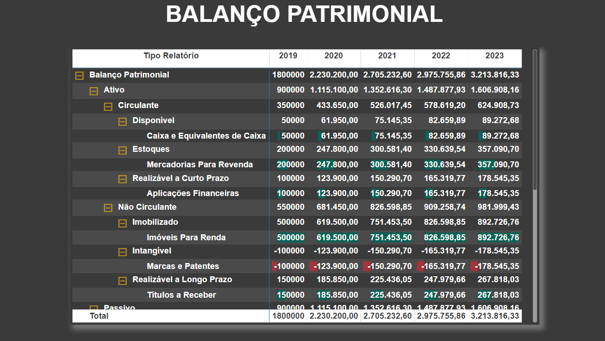

# Dashboard Conabilidade
 

  

 

## Sobre o projeto
Esse painel tem como foco a demonstração do balanço patrimonial de uma empresa. Para isso, foi utilizado a visão de Matriz, bem como foi disponibilizado a visualização de todos os níveis. Para facilitar a leitura, foi inserido um gráfico de barras onde é possível identificar os maiores e menores valores para cada ano. Isso auxilia a identificação dos maiores e menores ativos e passivos da empresa, ajudando nas decisões estratégicas.

* **[Projeto na íntegra (disponível para download)](https://github.com/raffaloffredo/dashboard_contabilidade/blob/main/dashboard_contabilidade.pbix)**
 

 

## Material Extra
Os dados utilizados nesse projeto referem-se à uma empresa fictícia e também estão disponíveis para download.

* **[Dataset Contabilidade](https://github.com/raffaloffredo/dashboard_contabilidade/blob/main/dataset_contabilidade.xlsx)**
 

## Outros projetos

* **[Dashboard Financeiro](https://github.com/raffaloffredo/dashboard_financeiro)**
* **[Dashboard Logístico](https://github.com/raffaloffredo/dashboard_logistica)**
* **[Dashboard de Marketing](https://github.com/raffaloffredo/dashboard_marketing)**
* **[Dashboard de Vendas](https://github.com/raffaloffredo/dashboard_vendas)**
* **[Dashboard de Vendas Globais](https://github.com/raffaloffredo/dashboard_vendas_globais/)**
* **[Airbnb New York](https://github.com/raffaloffredo/airbnb_new_york_portuguese)**
* **[Estudo atualizado sobre COVID-19 no Brasil e no mundo](https://github.com/raffaloffredo/covid_2023_portuguese)**
* **[Detecção de fraude em cartão de crédito](https://github.com/raffaloffredo/fraud_detection_portuguese)**
* **[Previsão de Churn](https://github.com/raffaloffredo/churn_prediction_portuguese)**
 

 ## Contatos

  
  
  
  
  

